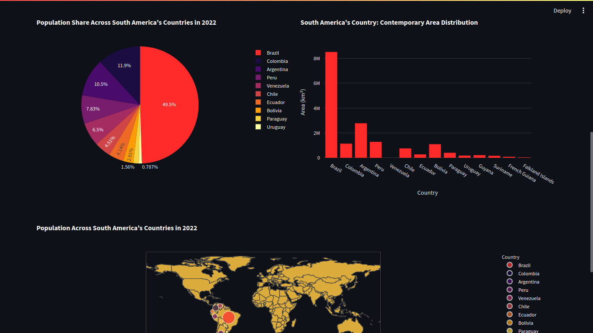

# World Population Dashboard

Welcome to the World Population Dashboard repository! This dashboard application is built with Streamlit and provides insightful information about world population.

## About the Dashboard

This dashboard aims to visualize various aspects of world population data. It offers an intuitive interface for users to interact with the data and gain valuable insights.

## How to Use

1. **Access the Dashboard**: Visit [world-population.streamlit.app](https://world-population.streamlit.app) to access the live version of the dashboard.

2. **Exploring the Data**: Once you're on the dashboard, you can navigate through different tabs and sections to explore the available data visualizations.

## Application Screenshot




## Libraries Used

- **Streamlit**: Streamlit is a powerful framework for creating web applications with simple Python scripts.
- **Pandas**: Pandas is a popular Python library used for data manipulation and analysis.
- **Plotly**: Plotly is a graphing library that makes it easy to create interactive plots and charts.

## Installation

To run this dashboard locally, you'll need to have Python installed on your system. You can follow these steps:

1. Clone this repository to your local machine:
   ```
   git clone https://github.com/pauloabraao/dashboard_world_population
   ```

2. Install the required dependencies using pip:
   ```
   pip install -r requirements.txt
   ```

3. Run the Streamlit app:
   ```
   streamlit run dashboard.py
   ```

4. Access the dashboard in your web browser at `http://localhost:8501`.

## Feedback

We welcome any feedback or suggestions for improving this dashboard. Feel free to open an issue or submit a pull request if you have any ideas for enhancements or if you encounter any issues.

Thank you for using the World Population Dashboard! We hope you find it informative and useful.


